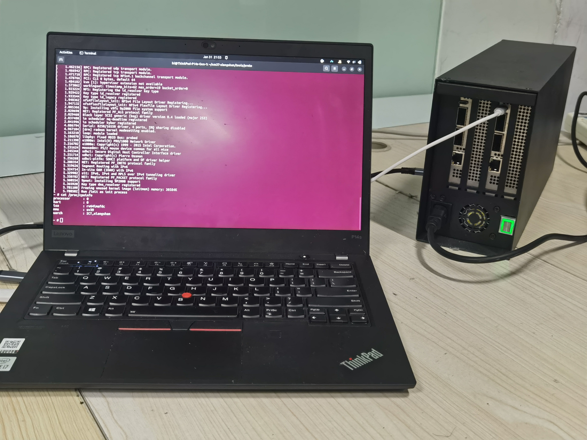

# NEXST(desktop version)

NEXST stand for *Next Environment for [XiangShan](https://github.com/OpenXiangShan/XiangShan) Target*. This system serves as an FPGA prototyping and accelerated emulation environment for processor system level test.
The environment has been successfully ported to a local desktop setup, allowing access to the PCIe add in cards via Thunderbolt.
# Project Overview
This project comprises two main parts:
- The NEXST code and the dependency [XDMA drivers](https://gitlab.agileserve.org.cn:8001/serve\_hw\_sw\_dev/dma\_ip\_drivers).
- The first version of the expansion enclosure prototype.

Related repositories can be found on SERVE platform(A hardware/software DevOps platform for agile chip development). If you are interested, please [register](imgs/registration.png) an account to gain access.
| Component | Original README | Repo(Requires Registration) |
| :---: | :---: | :---: |
| nexst | [README](READMES/README\_NEXST.md) |https://gitlab.agileserve.org.cn:8001/serve_hw_sw_dev/nexst |
| enclosure | [README](READMES/README\_enclosure.md) |https://gitlab.agileserve.org.cn:8001/jianghaolin/enclosure |

# More About The System
You can check out [REMU tutorial at ICSA24](https://remu.agileserve.org.cn:30188) and [improvement for this project](https://github.com/CaptainNemo11/my_xapp1338)
# Contributor
Haolin Jiang, Research Assistant supervised by [prof. Ke Zhang](https://people.ucas.ac.cn/~zhangke?language=en) and prof. YiSong Chang at [ICT, CAS](http://english.ict.cas.cn/)

